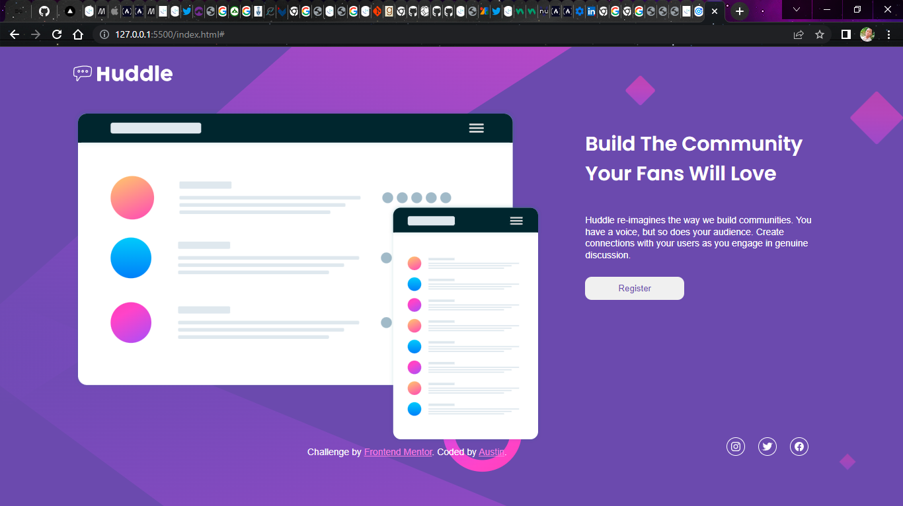

# Frontend Mentor - Huddle landing page with single introductory section solution

This is a solution to the [Huddle landing page with single introductory section challenge on Frontend Mentor](https://www.frontendmentor.io/challenges/huddle-landing-page-with-a-single-introductory-section-B_2Wvxgi0). Frontend Mentor challenges help you improve your coding skills by building realistic projects.

## Overview

This is my solution to the above challenge.
Every line of code written by https://twitter.con/austinnze1000 .

### Screenshot

### Links

- Solution URL: [https://www.frontendmentor.io/solutions/desktop-design-using-html-and-css-flexbox-cpZ4TotgWQ]
- Live Site URL: http://huddle-landing-page-xi-five.vercel.app/

## My process

First got the right approach to come up with this , added necessary files and folders,
started with the HTML5 code which is the structure of a site.
Styled with a CSS style sheet.
initialized on git and pushed this codes to github using the command prompt.

### Built with

- Semantic HTML5 markup
- CSS custom properties
- Flexbox

### What I learned

I have learnt hoe to use ionicon as an alternative to fontawesome because of some problems encountered.
Secondly, I got another understanding of css flexbox.

### Continued development

I wish to have an understanding of making a responsive site whether static or dynamic.
Flex containers and margin manipulations.

### Useful resources

- [ionicons](https://ionicons.com) - This helped me to add the soial media icons.
  I really like it and will make use of it in future projects.

- [Google Fonts](https://fonts.google.com) - This is an amazingdite which helped me add the required font in my project.
  I'd recommend it to anyone still learning this concept.

## Author

- Name - Austin
- Frontend Mentor - [@yourusername](https://www.frontendmentor.io/profile/yourusername)
- Twitter - [@austinnze1000](https://www.twitter.com/austinnze1000)

## Acknowledgments

I appreciate the authors of frontend mentor for putting up this platform ,
where learner's and master's take up a challenge to test their abilities,
Even providing the materials needed to do this challenge. Kudos!
